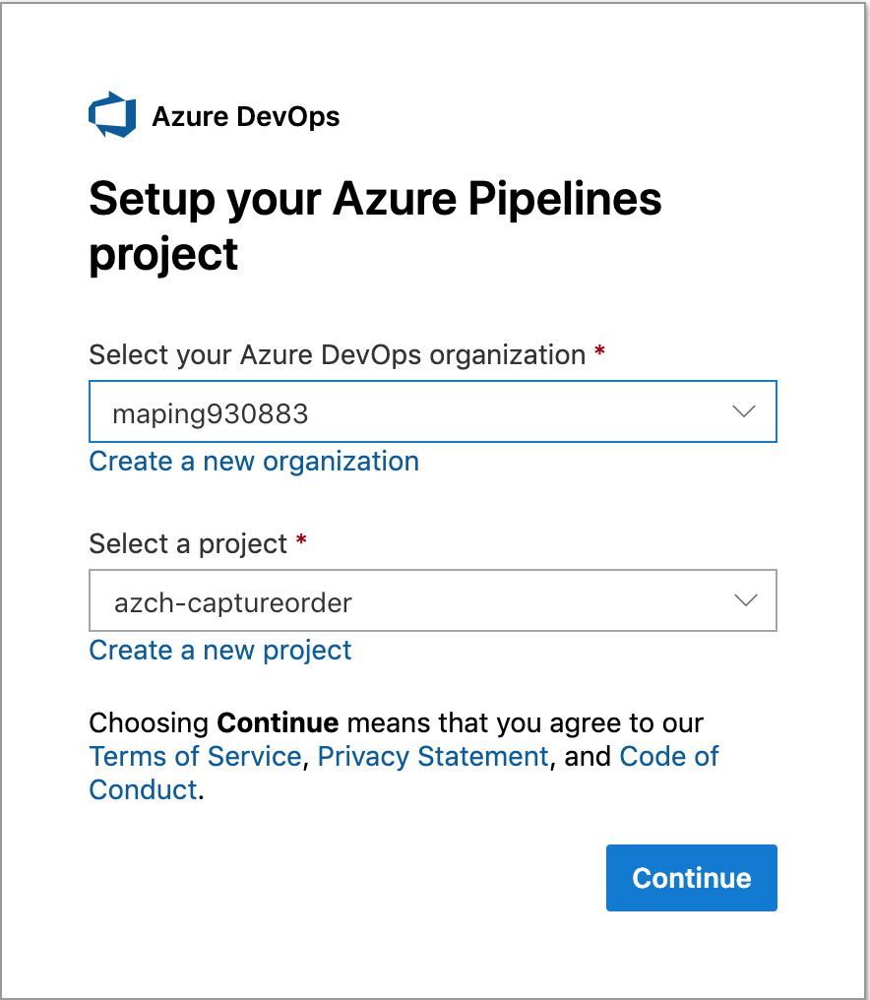
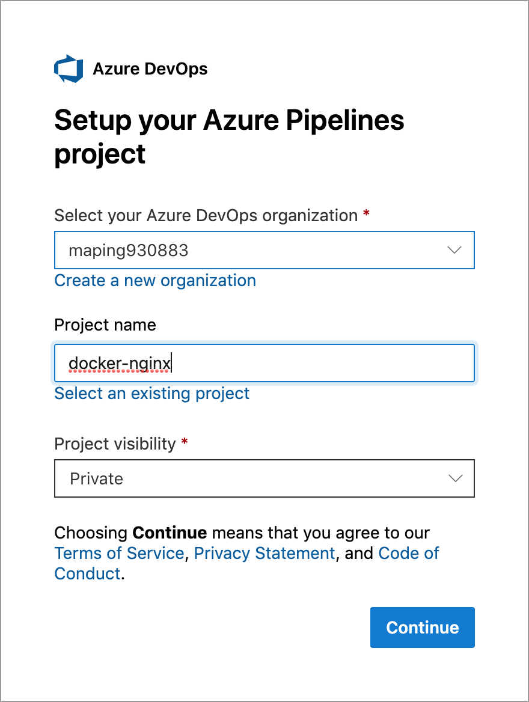
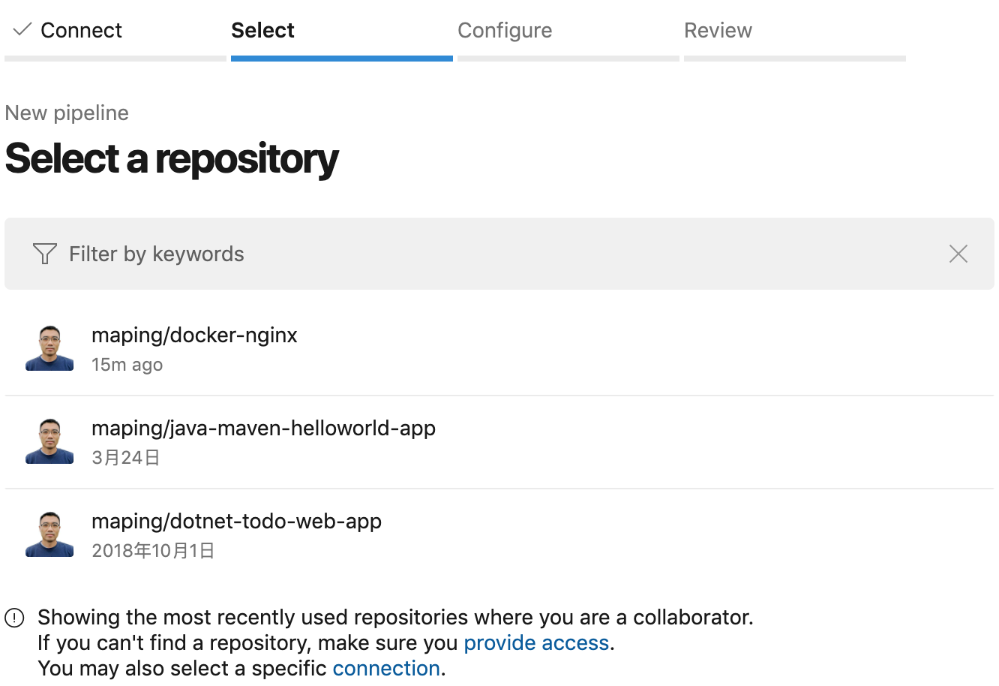

[](https://maping930883.visualstudio.com/docker-nginx/_build/latest?definitionId=15&branchName=master)

# 实验说明1
修改源代码并提交之后，触发 Azure Pipeline CI 过程，从 Docker Hub 拉取镜像，启动容器，展示新的应用。

## 1. 创建镜像
```console
$ docker build -t="maping930883/nginx_static_web" .
```

## 2. 运行容器
```console
$ docker run  -p 80:80 maping930883/nginx_static_web
```

## 3. 访问应用
```console
$ docker ps -n 1
CONTAINER ID        IMAGE                           COMMAND                  CREATED             STATUS              PORTS                NAMES
6da0a5c7978c        maping930883/nginx_static_web   "nginx -g 'daemon of…"   41 seconds ago      Up 41 seconds       0.0.0.0:80->80/tcp   condescending_borg
```

访问 http://localhost

## 4. 与 Azure Pipeline 集成
选择 Settings -> Intgretions & Services，点击 Azure Pipelines 旁边的 Configure 按钮，
拉到下面，Repository access -> Only select repositories，搜索 docker-nginx，回车后，会自动转到 Azure DevOps 登陆界面。


登陆后，选择 Organization，



选择创建 Create a new project，点击 Continue，将为你创建一个 Azure DevOps Project。



选择 Select a repository，选择 maping/docker-nginx



选择 Configure your pipeline，选择 Starter pipeline，点击 Save and Run，将会在 maping/docker-nginx Repo 中创建一个 azure-pipelines.yml 文件，并启动第一次 Build。
